# X & O's

The game of X & O's demonstrates the powerful use of JavaScript and how it can be pieced together to produce a simple yet engaging game. This site is targeted to an audience of all ages, who are both interested in the way that JavaScript works and seek some nostalgia through a game that most people have played in their lifetime, either with a pen and paper or on a site like this!

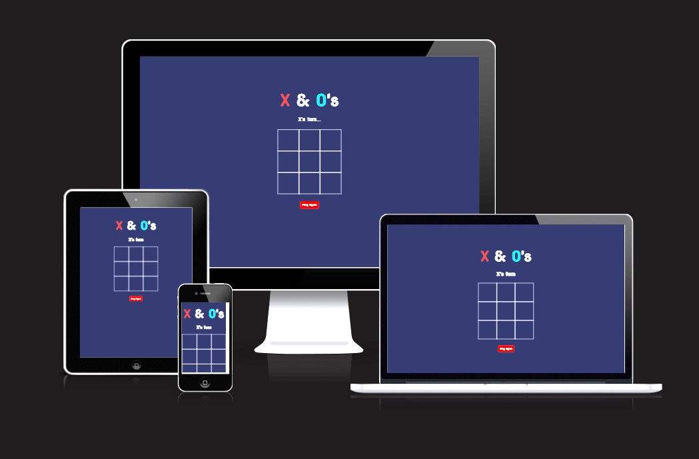

## Features

- __Favicon__

  - The Favicon that is found on the left hand side of the tab has been added with the intention of helping the user to easily navigate back to the page if they have left the site and wish to return to it.
  - The nature of the icon itself is a visual representation of the site displays to the user which not only gives the site a uniform theme, but also helps with general navigation.

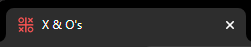

- __Title__

  - The X & O's title makes the user aware of the name of the game and also showcases the colour of each player. By using the same colouring in the title and the game itself, it enables the user to clearly understand what moves they have made. This was also done to make the website more aesthetically pleasing to the user.

- __Player Turn Information__

  - This section of the site assists the user/s in their understanding of who's turn is next. The game will always start with the person in control of the X's. One they have taken their turn, the message will automatically update to display that it is the person who is in controls of the O's that takes their turn next. Without this information on display, the user/s may lose track of which turn was last taken and input a value that they did not intend.

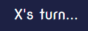
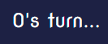

- __The Game Board__

  - The board consists of a 3x3 grid that contrasts the background to make it clear and easy on the eye.
  - On a desktop or laptop, the user can use their mouse to hover over each cell of the grid to make the cell appear a few shades lighter than the background colour, before making their move. This highlighting of the cell was implemented with the intention of making the users' ability to make their decision as intuitively as possible. For tablets and mobile devices, the selected cell will stay highlighted once the screen is pressed until the next move is made where the most recently selected cell is then subsequently highlighted.
  - The markers of X's and O's themselves echo the same style and colour that is seen in the title of the site. The chosen colouring allows the user to clearly see which moves are their own and contrasts the background so that the markers are visible and clear.
  - In the event that the game finishes with a win, any unused cells are kept clear of any markers and become unselectable. This prevents any cell cells from being accidentally selected after the game has ended and keeps the game running smoothly.

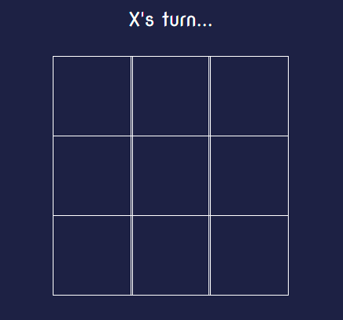
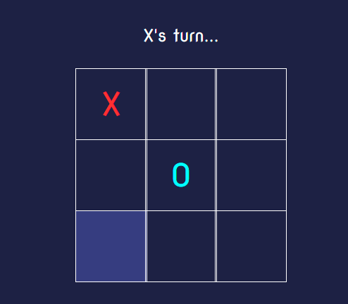
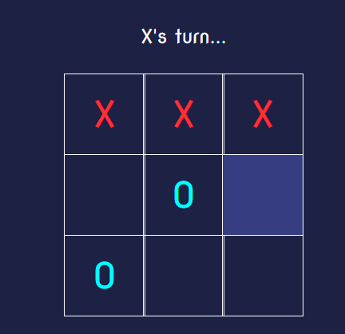

- __Game Result Messages__

  - Below the grid, a message will be displayed to the user/s once either there are three X's in a row or three O's. In the event that neither player wins, a message is displayed to the user/s making them aware that the game finished in a tie. 
  - The result message itself is only displayed once the game is no longer able to continue.
  - In future, adding a score tracking system may be useful to the user/s who intend on playing multiple rounds and enjoy engaging in competition.

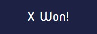
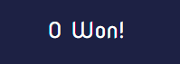
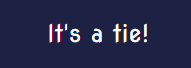

- __Play Agin Button__

  - This button will clear each cell on the grid of any markings from a previous game, allowing the user to start a fresh game.
  - The colour of the button was chosen with the intention of making it clear to the user where they need to click/press if they want to play a fresh game or start over. Much like the selection of the cells on the game board, the button will also turn a darker shade of red when the mouse is hovered over it (or is pressed for mobile and tablets).

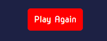
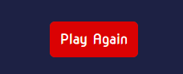

## Future Features

- __A button that shows the game results history__
- __An animation that draws a line through the game winning cells on the grid when the game is over__

## Testing

- I have tested that the website runs correctly on different browsers such as Chrome, Safari and Firefox.
- I have confirmed that the website is responsive, maintains a clean structure and functions across all screen sizes. Tested screen sizes include desktops, tablets and modern smartphones. This was achieved by using the developer tools in Google Chrome and through actual use on each of the aforementioned devices.
- I confirmed that the game itself functions correctly and that all possible results are matched with the logical and correct result.
- I have ensured that the strings that announce which users turn is next displays the correct value at each given event.
- I have asked my partner and family members to play the game on my devices and their own to ensure that there are no bugs and that the site is easy to use and it aesthetically pleasing.

## Fixed Bugs

- Upon applying a style rule to the values that are entered into each cell on the grid, I noticed that after pressing the button to reset the game, all of the cells that where involved in the prebious game where staying as one colour. To fix this, I added a line of code to the for rule of the resetBtn variable in the script.js file to remove 'x' and 'O' from the class list which fixed the issue.

## Validator Testing

- __HTML__

  - No errors where returned when using the W3 validator

- __CSS__

  - No errors or warnings where returned when using the W3C CSS validator

- __JavaScript__

  - No errors were found when passing through the official Jshint validator. The following metrics were returned:
    - There are 4 functions in this file.
    - Function with the largest signature take 0 arguments, while the median is 0.
    - Largest function has 15 statements in it, while the median is 7.
    - The most complex function has a cyclomatic complexity value of 6 while the median is 3.5.

- __Deployment__

  - This site was deployed via GitHub Pages.To do this youself you will need to:
    - Select the settings tab within the GitHub repository.
    - Under the Code and automation section, select pages.
    - Within the branch drop-dwon, select the 'main' branch and ensure that the /(root) folder is selected and press save.
    - Once all of the above are completed, a link to the completed website was provided at the top of the page. Here is the link: https://1ukefg.github.io/P2-X---O-s/

- __Credits__

  - The favicon was taken from the [Icons8](https://icons8.com/icons/set/xo) website.
  - The font that is featured on the site was sourced from [Google Fonts](https://fonts.google.com/)